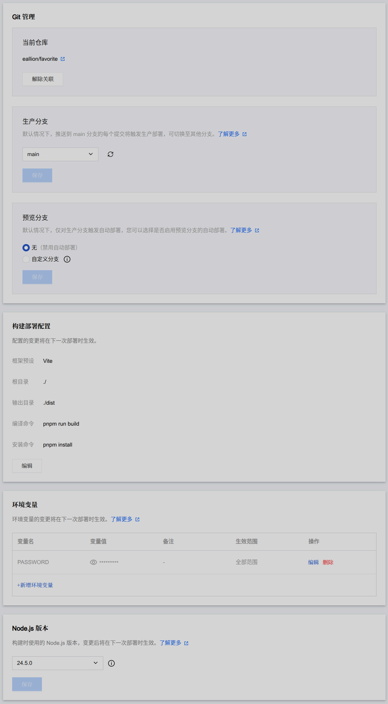

# 蜗牛个人导航 (CloudNav)

> [!WARNING]
> **本项目完全基于 AI 构建，我对项目中的代码一无所知。如果有 Bug 和功能需求请 Fork 后自行处理。**

**一个现代化云端导航 / 书签管理页面。**


## ✨ 特性

- **全分类锚点页面**：所有分类同屏展示，侧边栏一键跳转
- **前端可视化编辑**：右键菜单 / 拖拽排序 / 批量操作 / 分类管理
- **访客模式**：普通用户可正常浏览，登录后获得管理权限
- **KV 按分类存储**：链接按 `links:{category_id}` 拆分存储，读取时自动聚合
- **多平台部署**：EdgeOne Pages / Cloudflare Pages / Vercel 一键部署
- **KV 云端存储**：数据持久化，localStorage 缓存 + KV 双向同步
- **安全管理**：安全随机 Token 鉴权，登录时自动清理旧 Token，支持密码过期时间配置
- **AI 辅助**：集成 Gemini / OpenAI 兼容 API，自动填充链接描述、智能分类建议
- **数据导入导出**：Chrome 书签 HTML / JSON 备份 / WebDAV 云同步
- **丰富小组件**：实时天气（和风天气）、Mastodon 动态滚动条
- **个性化**：深色/浅色模式（自动检测系统偏好）、紧凑/详细视图、自定义图标
- **卡片动效**：从图标提取主色调，hover 时显示彩色边框 and 光晕
- **骨架屏加载**：加载时显示骨架屏占位，卡片交错淡入动画

## 🧩 浏览器插件

你可以配合 **Chrome** /  **Firefox** 浏览器插件来快速添加书签：

[](https://github.com/eallion/chrome-extension-favorite) [](https://github.com/eallion/firefox-extension-favorite)

## 🏗️ 技术架构

#### 技术栈

- React 19
- TypeScript
- Vite
- Tailwind CSS 4

#### Serverless

- EdgeOne Pages
- Cloudflare Pages [wip]
- Vercel [wip]

```
┌─────────────────────────────────────────────┐
│               Browser (Client)               │
│                                              │
│  React 19 + TypeScript + Tailwind CSS 4      │
│  State: Context + useReducer                 │
│  DnD: @dnd-kit                               │
│  Icons: lucide-react                         │
│                                              │
│  Data: localStorage (cache) + KV (persist)   │
└──────────────────┬───────────────────────────┘
                   │ HTTP API
┌──────────────────┴───────────────────────────┐
│       EdgeOne Pages Functions + KV            │
│                                              │
│  KV 存储：links:{category_id} 按分类拆分     │
│  认证：安全随机 Token + 自动清理旧 Token      │
│  平台适配：_kvAdapter.js 自动检测运行环境    │
└──────────────────────────────────────────────┘
```

## 🚀 部署指南

### EdgeOne Pages

1. Fork 或克隆本仓库
2. 在 EdgeOne 控制台创建 Pages 项目
3. 构建设置：
   - 框架预设：`Vite`
   - 输出目录：`./dist`
   - 安装命令：`pnpm install`
   - 编译命令：`pnpm build`
4. 绑定 KV：
   - 创建 KV 命名空间
   - 变量名称：`CLOUDNAV_KV`
5. 环境变量：
   - `PASSWORD`：管理后台登录密码
   - `ALLOWED_ORIGIN`：CORS 允许的域名（可选）
6. 重新部署

### Cloudflare Pages / Vercel

> Cloudflare Pages 和 Vercel 的部署支持正在开发中，API 函数代码在 `api/` 目录。

## ⚙️ 环境变量

| 变量 | 说明 | 必填 | 默认值 |
|------|------|------|--------|
| `PASSWORD` | 管理后台登录密码 | 是 | - |
| `ALLOWED_ORIGIN` | CORS 允许的域名 | 否 | `*` |



## 🛠️ 本地开发

```bash
# 安装依赖
pnpm install

# 启动 Vite 开发服务器 (localhost:3000，仅前端)
pnpm dev

# 链接 EdgeOne Pages KV
edgeone pages link

# 使用 EdgeOne Pages 本地开发（含 Functions + KV）
edgeone pages dev

# 构建生产版本
pnpm build

# 代码检查
pnpm lint

# 类型检查
pnpm type-check
```

### 数据存储

- **KV Key 结构**：链接按分类拆分存储，key 格式为 `links:{category_id}`
- **本地开发**：使用 EdgeOne CLI 的本地 KV 模拟，或 `src/utils/kvMock.ts`
- **首次部署**：使用 `types.ts` 中的 `INITIAL_LINKS` 和 `DEFAULT_CATEGORIES` 作为初始数据

## 📁 项目结构

```
├── api/                       # Cloudflare/Vercel Serverless Functions (TypeScript)
├── components/                # 通用 UI 组件与弹窗 (Modal, Toast, ErrorBoundary, 小组件等)
├── functions/api/             # EdgeOne Pages Serverless Functions (JavaScript)
├── services/                  # 业务服务层 (AI, 书签解析, 导出, WebDAV, 图标获取等)
├── src/
│   ├── components/            # 页面核心业务组件
│   │   ├── layout/            # 布局 (AppLayout, Sidebar, Header, MainContent, ContentSkeleton)
│   │   ├── category/          # 分类 (CategorySection)
│   │   └── link/              # 链接 (LinkCard, PinnedSection)
│   ├── contexts/              # React Context 状态管理 (Auth, Links, Categories, Config)
│   ├── hooks/                 # 自定义 Hooks (Search, DragSort, DataSync)
│   ├── utils/                 # 工具函数 (Config, Security, ColorExtractor)
│   ├── constants/             # 常量定义
│   └── *.css                  # 样式文件 (index.css, hover-card.css)
├── public/                    # 静态资源 (Manifest, Favicon, Robots, Sitemap 等)
├── App.tsx                    # 应用入口 (Provider 组合层)
├── index.tsx                  # Web 入口文件
├── index.html                 # HTML 入口 (SEO & CSP 配置)
├── types.ts                   # TypeScript 类型定义 & 初始数据
├── pnpm-lock.yaml             # pnpm 锁文件
├── package.json               # 项目依赖与脚本
├── vite.config.ts             # Vite 构建配置
├── tailwind.config.js         # Tailwind CSS 配置
├── edgeone.json               # EdgeOne Pages 配置
├── wrangler.toml              # Cloudflare Pages 配置
├── vercel.json                # Vercel 部署配置
└── tsconfig.json              # TypeScript 全局配置
```

## 📄 License

本项目采用 [MIT License](LICENSE) 开源。
