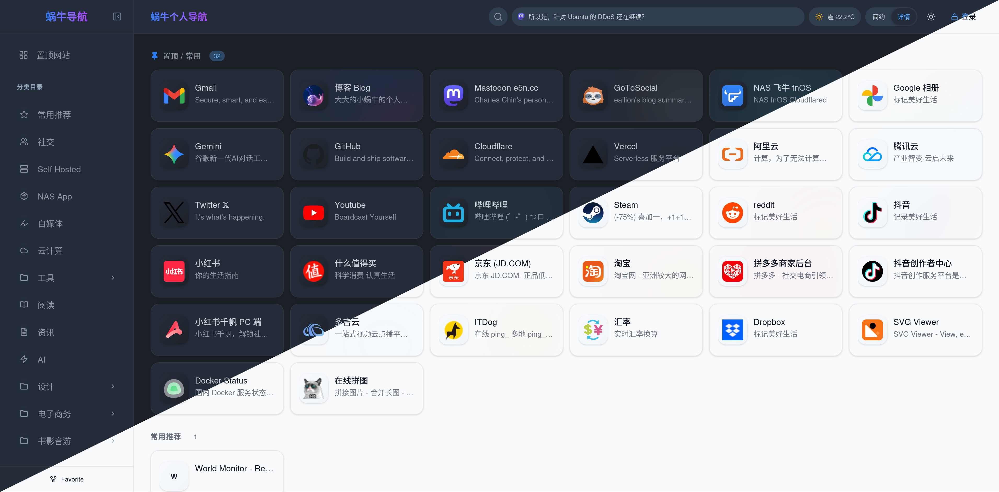

# 蜗牛个人导航 (CloudNav)

> [!WARNING]
> **本项目完全基于 AI 构建，我对项目中的代码一无所知。如果有 Bug 和功能需求请 Fork 后自行处理。**

**一个现代化云端导航 / 书签管理页面。**



## ✨ 特性

- **全分类锚点页面**：所有分类同屏展示，侧边栏一键跳转
- **前端可视化编辑**：右键菜单 / 拖拽排序 / 批量操作 / 分类管理
- **访客模式**：普通用户可正常浏览，登录后获得管理权限
- **KV 按分类存储**：链接按 `links:{category_id}` 拆分存储，读取时自动聚合
- **多平台部署**：EdgeOne Pages / Cloudflare Pages / Vercel 一键部署
- **KV 云端存储**：数据持久化，localStorage 缓存 + KV 双向同步
- **安全管理**：安全随机 Token 鉴权，登录时自动清理旧 Token，支持密码过期时间配置
- **AI 辅助**：集成 Gemini / OpenAI 兼容 API，自动填充链接描述、智能分类建议
- **数据导入导出**：Chrome 书签 HTML / JSON 备份 / WebDAV 云同步
- **丰富小组件**：实时天气（和风天气）、Mastodon 动态滚动条
- **个性化**：深色/浅色模式（自动检测系统偏好）、紧凑/详细视图、自定义图标
- **卡片动效**：从图标提取主色调，hover 时显示彩色边框 and 光晕
- **骨架屏加载**：加载时显示骨架屏占位，卡片交错淡入动画

## 🧩 浏览器插件

你可以配合 **Chrome** /  **Firefox** 浏览器插件来快速添加书签：

- [eallion/chrome-extension-favorite](https://github.com/eallion/chrome-extension-favorite)
- [eallion/firefox-extension-favorite](https://github.com/eallion/firefox-extension-favorite)

[](https://github.com/eallion/chrome-extension-favorite) [](https://github.com/eallion/firefox-extension-favorite)

## 🏗️ 技术架构

#### 技术栈

- React 19
- TypeScript
- Vite
- Tailwind CSS 4

#### Serverless / Storage

- **EdgeOne Pages**: Edge Functions + EdgeOne KV
- **Cloudflare Pages**: Pages Functions + Cloudflare KV
- **Vercel**: Vercel Functions + Vercel KV (Upstash Redis)

```
┌──────────────────────────────────────────────┐
│               Browser (Client)               │
│                                              │
│  React 19 + TypeScript + Tailwind CSS 4      │
│  State: Context + useReducer                 │
│  DnD: @dnd-kit                               │
│  Icons: lucide-react                         │
│                                              │
│  Data: localStorage (cache) + KV (persist)   │
└──────────────────┬───────────────────────────┘
                   │ HTTP API
┌──────────────────┴───────────────────────────┐
│     EdgeOne / Cloudflare / Vercel Backend    │
│                                              │
│  KV 存储：links:{category_id} 按分类拆分     │
│  认证：安全随机 Token + 自动清理旧 Token     │
│  平台适配：多平台 KV 接口抽象（屏蔽底层差异）│
└──────────────────────────────────────────────┘
```

## 🚀 部署指南

### EdgeOne Pages (推荐)

1. Fork 或克隆本仓库。
2. 在 EdgeOne 控制台创建 Pages 项目。
3. 构建设置：
   - 框架预设：`Vite`
   - 输出目录：`./dist`
   - 安装命令：`pnpm install`
   - 编译命令：`pnpm build`
4. 绑定 KV：创建 KV 命名空间，变量名称设为 `CLOUDNAV_KV`。
5. 环境变量：设置 `PASSWORD`（管理密码）。

### Cloudflare Pages

1. 在 Cloudflare 控制台创建 Pages 项目，连接 GitHub 仓库。
2. 构建设置：框架预设选择 `Other`，安装命令 `pnpm install`，输出目录 `dist`。
3. 创建并绑定 KV：
   - 导航至 **Workers & Pages** -> **KV** -> **Create a namespace**。
   - 名字设为 `CLOUDNAV_KV`。
   - 回到 Pages 项目设置 -> **Settings** -> **Functions** -> **KV namespace bindings**。
   - 添加绑定：变量名称设为 `CLOUDNAV_KV`，选择刚才创建的命名空间。
4. 环境变量：
   - 在项目设置 -> **Environment variables** 中添加 `PASSWORD`（管理密码）。
5. 重新部署。

### Vercel

1. 在 Vercel 控制台导入 GitHub 仓库，框架预设选择 `Vite`。
2. 创建并连接 KV：
   - 在项目顶部菜单点击 **Storage** -> **Create Database** -> **Upstash for Redis**。
   - 创建成功后，点击 **Connect** 按钮将其绑定到本项目。
   - Vercel 会自动注入 `KV_URL` 等环境变量。
3. 环境变量：
   - 在项目 **Settings** -> **Environment Variables** 中手动添加 `PASSWORD`。
4. 重新部署。

## ⚙️ 环境变量

| 变量 | 说明 | 必填 | 默认值 |
|------|------|------|--------|
| `PASSWORD` | 管理后台登录密码 | 是 | - |
| `ALLOWED_ORIGIN` | CORS 允许的域名 | 否 | `*` |

## 🛠️ 本地开发

```bash
# 安装依赖
pnpm install

# 1. 启动 Vite 开发服务器 (localhost:3000，仅前端)
pnpm dev

# 2. 模拟 EdgeOne 环境 (需安装 edgeone cli)
edgeone pages dev

# 3. 模拟 Cloudflare 环境 (需安装 wrangler)
pnpm build
wrangler pages dev ./dist --kv CLOUDNAV_KV

# 4. 模拟 Vercel 环境 (需安装 vercel cli)
# 需要先运行 vercel env pull .env.local 拉取云端 KV 变量
vercel dev
```

### 数据存储说明

- **KV Key 结构**：链接按分类拆分存储，key 格式为 `links:{category_id}`。
- **本地模拟**：EdgeOne 使用 CLI 模拟 KV；Vercel 需连接云端测试 KV 或使用 `kvMock.ts`。
- **首次部署**：系统会使用 `types.ts` 中的 `INITIAL_LINKS` 作为初始演示数据。

## 📁 项目结构

```
├── api/                       # Vercel Serverless Functions (TypeScript)
├── functions/api/             # EdgeOne / Cloudflare Pages Functions (JavaScript)
├── components/                # 通用 UI 组件 (Modal, Toast, ErrorBoundary, 小组件等)
├── services/                  # 前端业务逻辑 (AI, 书签解析, 导出, WebDAV 等)
├── src/
│   ├── components/            # 核心业务组件 (layout, category, link)
│   ├── contexts/              # React Context 状态管理 (Auth, Links, Categories, Config)
│   ├── hooks/                 # 自定义 Hooks (Search, DragSort, DataSync)
│   ├── utils/                 # 工具函数 (Config, Security, ColorExtractor)
│   └── constants/             # 常量定义
├── public/                    # 静态资源
├── App.tsx                    # 应用入口
├── types.ts                   # 类型定义 & 初始数据
├── vercel.json                # Vercel 部署配置
├── edgeone.json               # EdgeOne Pages 配置
└── package.json               # 项目依赖
```

## Inspiration

- [CloudNav-abcd](https://github.com/aabacada/CloudNav-abcd)

## 📄 License

本项目采用 [MIT License](LICENSE) 开源。
