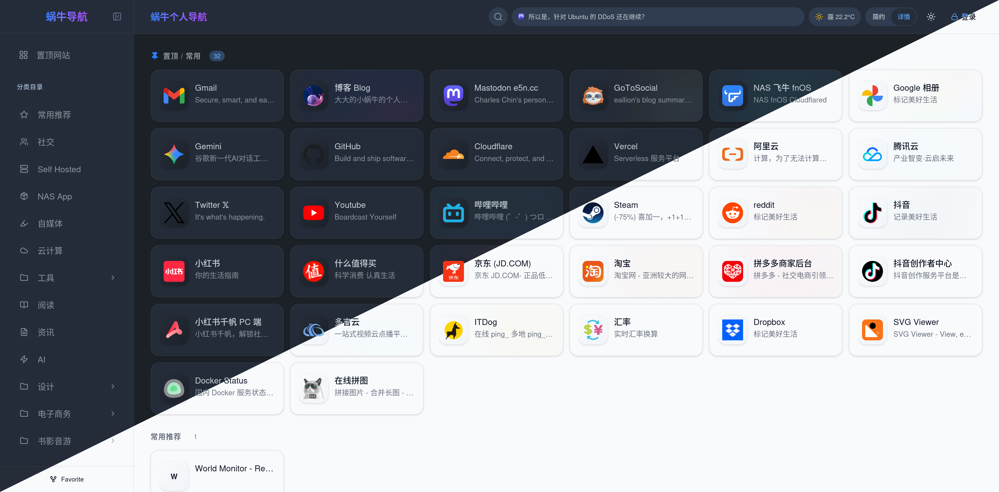

# 蜗牛个人导航 (CloudNav)

> [!WARNING]
> **本项目完全基于 AI 构建，我对项目中的代码一无所知。如果有 Bug 和功能需求请 Fork 后自行处理。**

**一个现代化云端导航 / 书签管理页面。**



## ✨ 特性

- **全分类锚点页面**：所有分类同屏展示，侧边栏一键跳转
- **前端可视化编辑**：右键菜单 / 拖拽排序 / 批量操作 / 分类管理
- **访客模式**：普通用户可正常浏览，登录后获得管理权限
- **D1 数据存储**：网站、分类、用户、会话、配置统一进入 Cloudflare D1
- **Cloudflare 部署**：Worker + D1 + 静态资源一体化部署
- **本地缓存**：localStorage 仅保留页面缓存和偏好设置，不再作为主数据源
- **安全管理**：Cookie 会话鉴权，支持管理员初始化、登录和简单用户管理
- **AI 辅助**：集成 Gemini / OpenAI 兼容 API，自动填充链接描述、智能分类建议
- **数据导入导出**：Chrome 书签 HTML / JSON 备份 / WebDAV 云同步
- **丰富小组件**：Mastodon / Memos 动态滚动条、实时天气（和风天气）
- **个性化**：深色/浅色模式（自动检测系统偏好）、紧凑/详细视图、自定义图标
- **卡片动效**：从图标提取主色调，hover 时显示彩色边框 and 光晕
- **骨架屏加载**：加载时显示骨架屏占位，卡片交错淡入动画

## 🧩 浏览器插件

你可以配合 **Chrome** /  **Firefox** 浏览器插件来快速添加书签：

- [eallion/chrome-extension-favorite](https://github.com/eallion/chrome-extension-favorite)
- [eallion/firefox-extension-favorite](https://github.com/eallion/firefox-extension-favorite)

[](https://github.com/eallion/chrome-extension-favorite) [](https://github.com/eallion/firefox-extension-favorite)

## 🏗️ 技术架构

#### 技术栈

- React 19
- TypeScript
- Vite
- Tailwind CSS 4

#### Serverless / Storage

- **Cloudflare Worker**: API 路由 + 静态资源托管
- **Cloudflare D1**: 统一存储网站、分类、用户、会话和设置

```
┌──────────────────────────────────────────────┐
│               Browser (Client)               │
│                                              │
│  React 19 + TypeScript + Tailwind CSS 4      │
│  State: Context + useReducer                 │
│  DnD: @dnd-kit                               │
│  Icons: lucide-react                         │
│                                              │
│  Data: localStorage (cache) + D1 (persist)    │
└──────────────────┬───────────────────────────┘
                   │ HTTP API
┌──────────────────┴───────────────────────────┐
│          Cloudflare Worker Backend           │
│                                              │
│  D1 存储：网站 / 分类 / 用户 / 配置 / 会话  │
│  认证：HttpOnly Cookie 会话                  │
│  统一 API：/api/bootstrap /api/sites 等      │
└──────────────────────────────────────────────┘
```

## 🚀 部署指南

### Cloudflare Worker + D1

1. 在 Cloudflare 控制台创建 Worker 和 D1 数据库。
2. 执行 `pnpm build` 构建前端资源。
3. 配置 `wrangler.jsonc` 中的 `d1_databases` 和静态资源绑定。
4. 执行 `pnpm deploy` 或 `wrangler deploy` 部署到 Cloudflare Worker。
5. 首次登录后在后台完成管理员 bootstrap，然后再添加站点和普通用户。

## ⚙️ 环境变量

| 变量 | 说明 | 必填 | 默认值 |
|------|------|------|--------|
| `CLOUDFLARE_API_TOKEN` | 创建 D1 / 远程部署时使用 | 部分场景 | - |

## 🛠️ 本地开发

```bash
# 安装依赖
pnpm install

# 1. 启动一体化本地开发环境（Worker + D1 + 静态资源）
pnpm dev
```

`pnpm dev` 会先构建静态资源，再通过 `wrangler dev` 在 `http://127.0.0.1:56435/` 提供页面和 `/api/*`。

### 数据存储说明

- **D1 表结构**：网站、分类、用户、会话和设置统一存储在数据库中。
- **本地缓存**：`localStorage` 仅用于提升首次渲染速度和保留用户偏好。
- **首次部署**：系统会通过 D1 和后台 bootstrap 进入空白初始状态，由管理员自行添加网站和分类。

## 📁 项目结构

```
├── components/                # 通用 UI 组件 (Modal, Toast, ErrorBoundary, 小组件等)
├── services/                  # 前端业务逻辑 (AI, 书签解析, 导出, WebDAV 等)
├── src/
│   ├── components/            # 核心业务组件 (layout, category, link)
│   ├── contexts/              # React Context 状态管理 (Auth, Links, Categories, Config)
│   ├── hooks/                 # 自定义 Hooks (Search, DragSort, DataSync)
│   ├── utils/                 # 工具函数 (Config, Security, ColorExtractor)
│   └── constants/             # 常量定义
├── public/                    # 静态资源
├── App.tsx                    # 应用入口
├── types.ts                   # 类型定义 & 初始数据
├── wrangler.jsonc             # Cloudflare Worker / D1 配置
└── package.json               # 项目依赖
```

## Inspiration

- [CloudNav-abcd](https://github.com/aabacada/CloudNav-abcd)

## 📄 License

本项目采用 [GLWTPL License](https://github.com/me-shaon/GLWTPL) 开源。

```
GLWT（Good Luck With That，祝你好运）公共许可证
            版权所有© 除作者外的所有人

任何人都被允许复制、分发、修改、合并、销售、出版、再授权
或任何其它行为，但风险自负。

作者对这个项目中的代码的行为一无所知。
代码处于可用或不可用状态，没有第三种可能


                祝你好运公共许可证
            复制、分发和修改的条款和条件

  0. 只要你永远不要留下任何可以追踪到原作者的线索，
你就可以随心所欲地做任何事，因此，不能因此责怪或追究
原作者的责任。

在任何情况下，作者均不对因使用或与本软件有关的合同诉讼、
侵权或其他方式产生的任何索赔、损害或其他责任负责。

自求多福吧。
```
